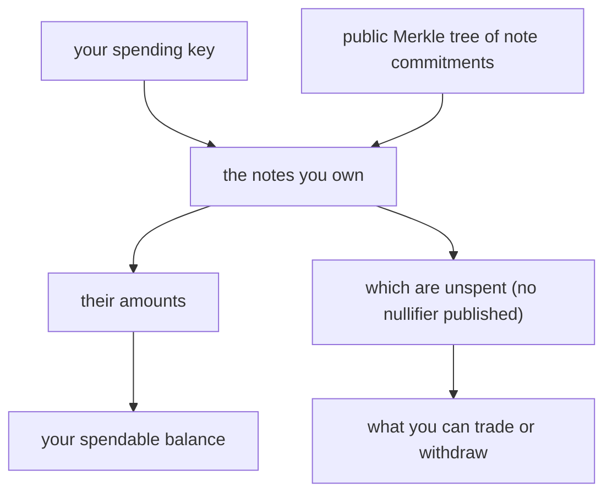
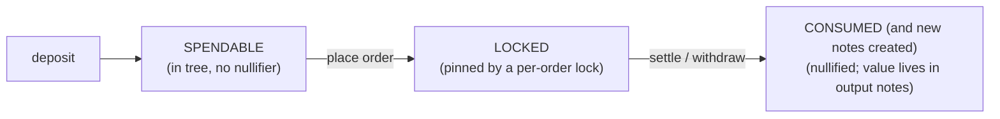

# Account Model

:::info TL;DR
Nyx has no server-held balance ledger. Your assets are **UTXO-style notes**
committed on-chain as hashes. Only you, with your spending key, can determine
which notes are yours and what they are worth. You reconstruct your account state
**client-side** from the public Merkle tree plus your keys; the engine never sees
the spending key that would let it do it for you.
:::

## Why there is no balance in `GET /account`

`GET /account` returns the slice of account state the engine legitimately holds:
your **open orders** (the orders you placed that are still in the book). It does
**not** return balances or notes.

On a custodial venue the operator keeps your balance in a database and serves it
on request. That only works because the operator can see what you hold, which is
exactly the position privacy Nyx is built to remove.

On Nyx your balance is the set of **notes** you own. A note is committed on-chain
as a Poseidon hash that seals its owner, value, and token. Determining that a
given note is *yours* and reading its amount requires your **spending key**, and
that key never enters the enclave. So the engine *cannot* compute your balance
for you, by construction. A balance endpoint would either be empty or would
require handing the enclave the one secret the whole design keeps out of it.

Instead, you reconstruct account state yourself:

This is the self-custodial design: the data needed for recovery is public, and
only your keys turn it into a balance. Before sending private order intent, you
still verify the enclave measurement and signer set; see
[Privacy & Attestation](../how-it-works/privacy-and-attestation).

## What you read, and from where

| You want | Read | Page |
|---|---|---|
| The current state of the on-chain tree | `GET /tree/root` | [Merkle Proofs](./merkle-proofs) |
| An inclusion proof for one of your notes | `GET /tree/inclusion` | [Merkle Proofs](./merkle-proofs) |
| A page of raw leaves (to rebuild a local mirror) | `GET /tree/leaves` | [Merkle Proofs](./merkle-proofs) |
| Your open orders | `GET /account` (all), or `GET /orders/{order_id}` + the orders stream | [Get Order](../orders/get-order), [Orders Channel](../websocket/orders-channel) |
| Your continuation fills | the fills stream / your durable history | [Fills Channel](../websocket/fills-channel) |
| Venue-wide solvency | `GET /transparency` | [Transparency](./transparency) |
| Your account preferences | `GET`/`PUT /account/settings` | (cancel-on-disconnect default, and so on) |

The **SDK** wraps this: from your seed it derives your keys, scans the tree, and
maintains a local note store of your spendable notes, so in practice you call an
SDK method, not the raw tree endpoints. See
[SDK → TypeScript Client](../sdk/typescript-client).

## The note lifecycle

A note moves through a small set of states, each enforced on-chain by a distinct
record so a note can never be used twice:

- **Spendable.** The note has an inclusion path in a recent Merkle root and no
  applicable consume record exists. You can back an order with it or
  withdraw it.
- **Locked.** An order references it as collateral; a per-order lock pins it
  between match and settlement so it cannot be double-committed.
- **Consumed.** Settlement/merge has created a commitment-keyed consumed-note
  entry, or withdrawal has published its nullifier. Its value now lives in freshly created output notes (a change
  note for the unfilled remainder, the traded asset, and so on), each a new
  spendable note you own.

Because every touched note produces an on-chain record that blocks a second
touch, double-spends are impossible regardless of what the engine does.

## Recovering your notes

Because your balance is derived, not stored by the venue, custody begins with a
securely generated **master seed** and its encrypted backup.

- **CSPRNG seed + encrypted backup.** Export the versioned authenticated backup
  and import it on a new device. Wallet-message signatures are not a seed or
  spend-authority mode.
- **Keys and notes.** From the seed the SDK derives your trading, spending, and
  viewing keys. A deposit's public recovery nonce reconstructs its hidden inner;
  merge and settlement outputs are derived from consumed openings and finalized
  chain data.
- **Settlement outputs.** Exact trade and partial-fill change notes are
  recoverable from the **encrypted ciphertext stored on-chain at settlement**.
  The SDK decrypts the two-amount tuple with your viewing key, derives outputs
  from the consumed opening, and can rebuild deposit/fill/merge chains with
  `recoverNotesFromChain`. A live recovery drill remains a mainnet gate. See
  [Fills Channel](../websocket/fills-channel).

The upshot: protect the encrypted seed backup. The engine never becomes your
custodian; the seed backup + finalized chain are the durable recovery material.

## Trading keys vs. spending keys

Two different keys, two different jobs. Keep them distinct.

| Key | Used for | Seen by the enclave? |
|---|---|---|
| **Trading key** | Signing orders (place / cancel / modify). The cryptographic identity an order is attributed to. | The public key, yes, to verify your signature. |
| **Spending key** | Deriving note ownership and nullifiers; authorizing withdrawals. | **Never.** It stays on your client. |

The enclave can verify *who placed an order* (trading key) without ever being
able to determine *what you hold* (spending key). That split is what lets
matching be authenticated while balances stay private.

## Account settings

`GET` / `PUT /account/settings` holds a small set of per-account preferences,
persisted with your account. A `PUT` replaces them wholesale, so send the full
object.

| Setting | Default | Effect |
|---|---|---|
| `cancel_on_disconnect_default` | `false` | When `true`, a [trading socket](../websocket/ws-trading) or [session stream](../websocket/session-stream) for this account cancels your open orders when it disconnects. A socket's own `cancel_on_disconnect` overrides this default. |
