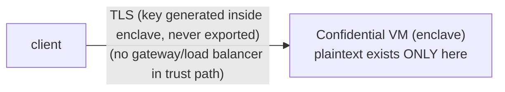

# Transport & Attestation

:::info TL;DR
TLS terminates **inside the attested enclave**, with a certificate whose private
key is generated in the VM and never leaves it. There is no separate gateway in
the trust path and no in-band session-encryption envelope to negotiate. The TLS
channel already reaches the measured code. Clients can **verify** they are
talking to the real engine by checking the attestation quote against an expected
image measurement.
:::

## The trust boundary

On many private venues, your connection terminates at a gateway or load balancer
that sits *outside* the system's trust zone, and a separate in-band encryption
handshake is layered inside TLS to defend against that gateway. Nyx does not have
that gap.

The TLS certificate Nyx serves is bound to a key the enclave generated and holds.
TLS therefore terminates *inside* the confidential VM, the same boundary that
runs the matching engine. There is no intermediate hop that sees plaintext, so
there is no need for a second encryption layer:



What this gives you:

- **Confidentiality and integrity to the enclave.** Order intent is encrypted on
  the wire and decrypted only inside the measured code.
- **No extra handshake.** You use ordinary HTTPS and `wss://`; there is no
  `session.setup`, key-exchange, or rekey step to implement.

## Verifying the engine

TLS proves you have a private channel to *something*. Attestation proves that
something is the **specific, measured Nyx engine** and not a substituted binary.
Verification is a client-side step you run once at connect (or whenever you want
the strong guarantee).

### GET /info

Returns the identity of the running image.

```text
GET /info
```

```json
{
  "app_id": "…",
  "instance_id": "…",
  "compose_hash": "…",
  "tee_pubkey": "…",
  "tee_pubkeys": ["…", "…"],
  "boot_session_id": "…",
  "nyx_version": "…"
}
```

| Field | Description |
|---|---|
| `app_id` | Deterministic id derived from the deployer and the compose configuration. |
| `instance_id` | Identifier of this specific VM instance. |
| `compose_hash` | Self-reported SHA-256 of the deployment manifest. Useful for display; the authoritative value comes from the quote-bound event log. |
| `tee_pubkey` | Primary (shard-0) Ed25519 settlement signer, kept as a convenience field. |
| `tee_pubkeys` | Full ordered signer set, one per tree shard. Verify the entire set against finalized `VaultConfig.tee_pubkeys`. |
| `boot_session_id` | Fresh process-boot id signed into every canonical order, preventing cross-restart replay. |
| `nyx_version` | Build version tag of the engine. |

### GET /attestation

Returns an Intel TDX attestation quote plus the data needed to verify it.

```text
GET /attestation?reportData=<optional-nonce>
```

The quote is a hardware-signed measurement of the running VM. A client passing a
fresh `reportData` nonce gets a quote bound to that nonce (freshness) and to the
hash of the complete ordered signer set.

| Field | Description |
|---|---|
| `quote` | Hex-encoded TDX quote (DCAP format), the hardware-signed measurement. |
| `event_log` | The boot event log, replayed during verification to confirm the recorded compose hash and instance identity. |
| `report_data` | 64 bytes bound into the quote: caller nonce in bytes 0–31, then `SHA-256(pk0 || … || pkK-1)` in bytes 32–63. |
| `tee_pubkey` | Primary signer, for convenience. Fetch `/info.tee_pubkeys` to recompute the bound set hash. |

### The verification chain

A verifying client confirms, in order:

1. The TDX quote's hardware signature is valid and the platform's trusted
   computing base is current (standard DCAP verification).
2. Replaying the returned event log reproduces the DCAP-verified quote's RTMR3;
   the `compose-hash` event then equals the independently pinned release value.
3. The quote's `report_data` binds the full ordered signer set advertised by
   `/info`, and that exact set equals a **finalized** on-chain
   `VaultConfig.tee_pubkeys` read.

The SDK ships a helper that runs this chain for you against an expected
measurement. Only when all three hold should a client trust the channel with
order intent.

:::caution Pin the measurement, not the host
The security guarantee comes from the **measurement**, not from the hostname.
A client that connects over TLS but skips attestation has confidentiality to
*some* machine; it has not verified that the machine runs the expected engine.
Pin a release measurement independently, then verify the quote and event log.
:::

### The TLS certificate is attested too

The files under `/evidences/` (`quote.json`, `cert.pem`, and an integrity
checksum) let a client confirm that the **served TLS certificate** is bound to a
key held inside the enclave, closing the loop between "I have a TLS channel" and
"the TLS channel reaches the attested code." A client that verifies this binding
does not have to take the certificate authority's word for which machine holds
the key.

## What attestation does and does not give you

| Guarantees | Does not guarantee |
|---|---|
| You are talking to the exact, measured engine build. | That you submitted the order you meant to (that is on your client). |
| The engine that matches controls the complete signer set accepted on-chain. | That matching obeyed an unmeasured policy or that the service will remain live. |
| Order intent is confidential in transit and at rest inside the enclave. | Protection against losing your own keys; custody of the trading and spending keys is yours. |
