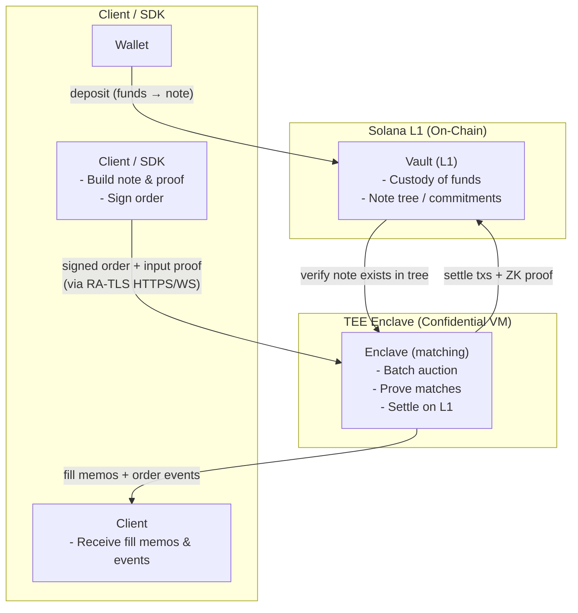

# Trade Flow

:::info TL;DR
You deposit funds into the on-chain vault as a private **note**. You submit a
hidden order, backed by that note, to the enclave. The enclave matches it in a
batch auction and proves the matches, then settles them on Solana itself, moving
value between notes against a zero-knowledge proof. Your order never becomes a
Solana transaction. Only the *result* settles.
:::

## Order-to-settlement lifecycle

## Step by step

| Step | Where | What happens |
|---|---|---|
| **1. Deposit** | Wallet → Vault | The SDK proves a new note is well formed, then deposits tokens into the on-chain vault. The transaction reveals signer, mint, and gross amount, but keeps the note owner and inner value private. |
| **2. Build the order** | Client / SDK | The wallet selects a spendable note and reads the current boot session; the SDK generates a zero-knowledge **input proof**, derives a contributory viewing key, and binds everything into a body signed by your **trading key**. |
| **3. Submit** | Client → Enclave | The signed order is sent over RA-TLS. The enclave verifies the signature, boot session, strictly increasing per-key nonce, viewing point, and note opening. It never touches a Solana transaction. |
| **4. Match** | Enclave | Each batch, the engine collects crossing orders and clears them at a single **oracle-anchored price** (see [Clearing Price](../trading-concepts/clearing-price)). Orders from the same trading key never match each other. |
| **5. Prove** | Enclave | The engine proves asset identity, scaled floor-price arithmetic, conservation, the configured fee, and deterministic output ownership for every active match. Oracle and limit-price policy remain enforced by the attested matcher. |
| **6. Settle** | Enclave → Vault (L1) | The engine locks inputs, verifies one batch proof, then sends each match independently. Confirmed matches create output notes; ambiguous matches remain reserved; definitive failures are terminal and require a fresh order after unlock. |
| **7. Notify** | Enclave → Client | Only confirmed matches commit book quantities and publish fills. The orders and fills channels carry lifecycle events and encrypted recovery data; expired batch markers are reclaimed asynchronously. |

## What is on-chain and what is not

| On-chain (public, verifiable) | Off-chain (private, in the enclave) |
|---|---|
| Custody of funds | Order intent (side, size, limit price) |
| The Merkle tree of note commitments | The order book |
| Withdrawal nullifiers and settlement consumed-note guards | The matching computation and traders' limits |
| The Groth16 proof verifier | The clearing-price calculation |
| Every settlement transaction + its proof | The link from a trade to a wallet |

The chain sees that *value moved correctly between committed notes*, proven by
zero knowledge. It never sees the orders that produced the trade, nor the
trade's plaintext size or price. The enclave sees the orders and chooses matches;
clients therefore verify its attestation for matching fairness, while the chain
independently rejects settlements that violate the proof-enforced invariants.

## Why your order never hits the chain

A common misconception is that a private DEX "encrypts orders on-chain." Darknyx does
something stronger: **your order is never a transaction at all.** It lives only
inside the attested enclave. What lands on Solana is the *settlement*, a transfer
of value between notes accompanied by a proof that the transfer is correct. An
observer indexing Solana therefore does not obtain plaintext order fields from
the chain alone.

See [Privacy & Attestation](./privacy-and-attestation) for how you verify the
enclave is the real engine, and [Settlement](./settlement) for the on-chain
pipeline in detail.
