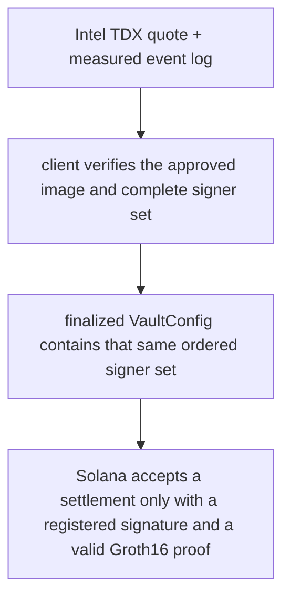

# Confidential VM Architecture

:::info TL;DR
Darknyx matches hidden orders inside an **Intel TDX confidential VM**. Hardware
attestation lets a client identify the measured software before revealing an
order, while Solana accepts settlement only from the registered signer set and
only with a valid zero-knowledge proof. This reduces trust in the infrastructure
operator, but does not erase it: clients still trust the approved measurement,
Intel TDX, governance, and the matching policy implemented by that measured code.
:::

## Why matching needs a confidential computer

A central limit order book normally needs to see every order. Publishing those
orders on-chain would reveal price limits, sizes, timing, and strategy before
execution. Pure zero-knowledge matching can hide more of that trust boundary,
but makes a feature-rich, low-latency book substantially harder to operate.

Darknyx uses a confidential VM as the private execution environment:

- encrypted memory limits what the host and infrastructure operator can inspect;
- a hardware-signed quote identifies the software measurement and boot state;
- TLS terminates inside the confidential deployment, so order intent is encrypted
  up to the measured service;
- the service derives an ordered set of settlement signers, one per Merkle shard.

This preserves the familiar order-entry experience while keeping custody and
settlement validity on Solana.

## From measurement to an accepted settlement

Attestation is useful only when it is connected to authority. Darknyx closes that
loop in three checks:

The quote binds a fresh client challenge and a hash of the complete ordered
signer set. The client also compares those signers with finalized on-chain
configuration. Checking only the hostname, the self-reported compose hash, or
the shard-0 key is insufficient.

## Which layer guarantees what

| Layer | What it contributes | What it does not establish |
|---|---|---|
| Intel TDX | Isolation from the host and a signed measurement | That the measured application policy is fair or bug-free |
| Client attestation | Approval of the measured release, boot freshness, and signer binding | Availability or future behavior after the check becomes stale |
| Solana vault | Custody, replay protection, proof verification, and public state | Confidential order intake or price-time fairness |
| Settlement proof | Market binding, scaled arithmetic, conservation, fees, and derived outputs | Whether the enclave chose the fairest eligible match or clearing price |
| Multisig governance | Controlled upgrades, roots, market configuration, and signer rotation | Safety if its quorum approves a malicious configuration |

This separation is intentional. Asset validity is proof-enforced; matching
policy remains an attested-code guarantee.

## What an infrastructure operator can still do

With an approved, correctly attested image and an uncompromised TDX platform, the
host should not be able to read plaintext order memory or forge a proof-valid
asset transition. It can still:

- stop or restart the service;
- delay, drop, or censor network traffic;
- observe timing, volume, and other network metadata;
- attempt to deploy a different image, which clients must reject unless it is an
  approved release and governance has registered its signer set.

A flaw in the measured application, the hardware, the attestation verifier, or
the governance process can weaken these properties. Darknyx therefore treats quote
verification, finalized key refresh, independent circuit review, and split
multisig control as launch requirements rather than optional operational polish.

## Why one CVM, not a committee

A committee can distribute trust, but adds coordination, latency, and a collusion
threshold. Darknyx currently chooses one confidential matching service with multiple
shard signers derived inside it. The product tradeoff is straightforward:

- faster private matching and a simpler client protocol;
- one attested software release to evaluate;
- a concentrated liveness boundary and dependence on TDX security.

The result is not “trustless matching.” It is a narrower, inspectable trust model:
trust the measured matcher for ordering and price policy; verify Solana and the
proof system for custody and settlement validity.

## What an integrator should verify

Before sending private order intent, verify the fresh quote, replay the measured
event log, approve the measured release, bind the complete signer set, and compare
it with finalized on-chain configuration. Pause new trading when that evidence or
the on-chain key view becomes stale.

See [Privacy & Attestation](./privacy-and-attestation) for the verification chain
and [Settlement](./settlement) for the proof boundary.
