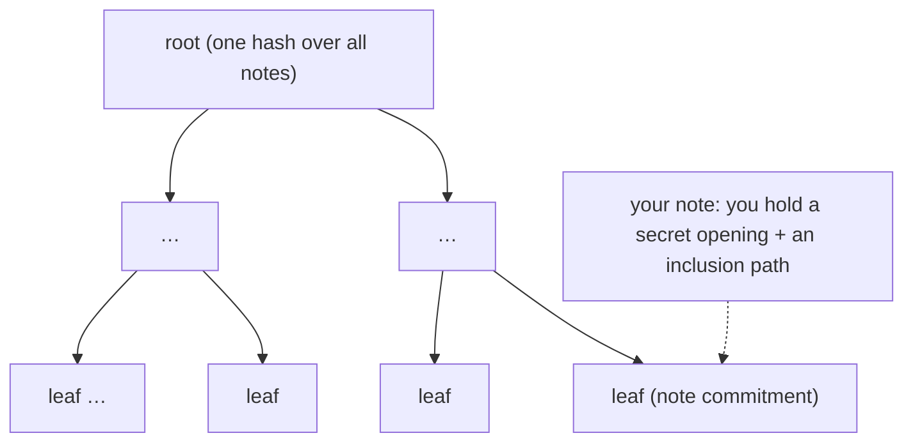
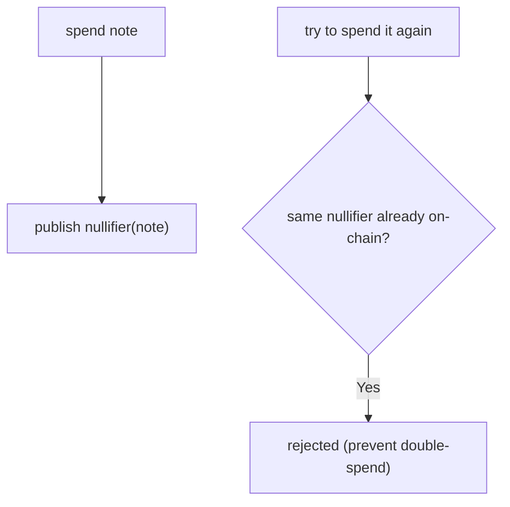
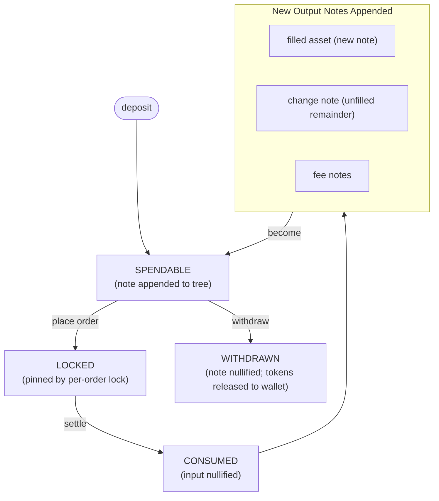

# Shielded Pool

:::info TL;DR
Your balance on Nyx is a set of **notes**, UTXO-style values committed on-chain
as Poseidon hashes. Commitments live in Merkle-tree shards. Withdrawals use
unlinkable nullifiers; TEE settlement and merges use commitment-keyed consumed
records. Zero-knowledge proofs enforce valid state transitions without exposing
shielded note openings.
:::

## Notes, not balances

A custodial venue stores your balance as a number in a database. Nyx stores it as
a set of **notes**. A note is a commitment, a Poseidon hash, to four things:

```text
note commitment = Hash( token mint, amount, owner, inner_hash )
```

The commitment reveals none of its inputs. From the outside, a note is an opaque
32-byte leaf in a tree. Only the owner, with their spending key, can recognize
which notes are theirs and read the amounts. This is what makes position privacy a
property of the data structure rather than a policy.

## The Merkle tree

Every note commitment is appended to an on-chain incremental **Merkle tree**. The
tree's root is a single hash summarizing every note that exists. To use a note you
prove, in zero knowledge, that it is a leaf under the current root, without
revealing *which* leaf.



The tree is **sharded** for settlement throughput (several independent subtrees,
each with its own root), but conceptually it is one accumulator of all
commitments. You read roots and inclusion paths through the
[Merkle Proofs](../account/merkle-proofs) endpoints.

## Replay guards prevent double-spends

A commitment proves a note *exists*. A **nullifier** lets a private withdrawal
prove that the same secret opening has not already been spent. It is computed so
that:

- it is **unlinkable** to the note commitment (publishing it does not reveal which
  note was spent), yet
- it is **deterministic**: spending the same note twice produces the same
  nullifier, and the second spend is rejected because the nullifier already
  exists.



Settlement payload v9 does not publish input nullifiers. Instead, lock and
settlement instructions derive PDAs from the input commitments; a second attempt
collides with the existing lock or `ConsumedNoteEntry`. Merge uses the same
commitment-keyed consume guard and proves every corresponding lock is absent. In
every path, replay prevention is enforced on-chain rather than left to the
matcher.

## The amount-independent inner hash

Each note's commitment and its nullifier are both anchored on a single
amount-independent value, the note's **inner hash**. For a match output, the
settlement circuit derives the new inner as
`Poseidon3(24, consumed_input_inner, role)`. The matcher can therefore re-lock a
partial-fill remainder without caller-selected output randomness or a per-fill
round-trip, while the client can independently reproduce the same opening.

## Spending in zero knowledge

To withdraw or merge, the client produces a zero-knowledge proof. For matched
trades, the attested engine produces a batch proof. Across these paths, the
proofs establish the relevant combination of:

1. the input note is a leaf under a recent tree root (it exists and is yours),
2. output notes conserve value and use the configured assets and fees, and
3. outputs are derived for the correct owner rather than chosen by the matcher.

The program verifies the proof and applies the result: it records the appropriate
replay guard, appends output commitments, and for a withdrawal releases tokens.
The chain learns that a valid transition happened, not the shielded trade
plaintext; a withdrawal necessarily reveals its transferred amount.

## Consolidating notes

An order is backed by a single note, so to trade more than any one note holds you
first **merge** several notes of the same token into one. A merge is a
zero-knowledge operation against the pool, like a spend: it consumes its input
notes (creating commitment-keyed consume records) and appends one output note carrying their
combined value, proven so nothing is created or destroyed. The SDK exposes it as a
single call, leaving you one larger spendable note to back a bigger order.

## The lifecycle, end to end



Every transition is gated on-chain by a distinct record (a wallet entry, a
withdrawal nullifier, a consumed-note marker, a note lock), so a note can never be used twice
regardless of what the engine does. See [Deposit](../account/deposit) and
[Withdraw](../account/withdraw) for the on-ramp and off-ramp,
[Account Model](../account/account-model) for how you reconstruct your spendable
set, and [Settlement](./settlement) for the on-chain spend pipeline.
