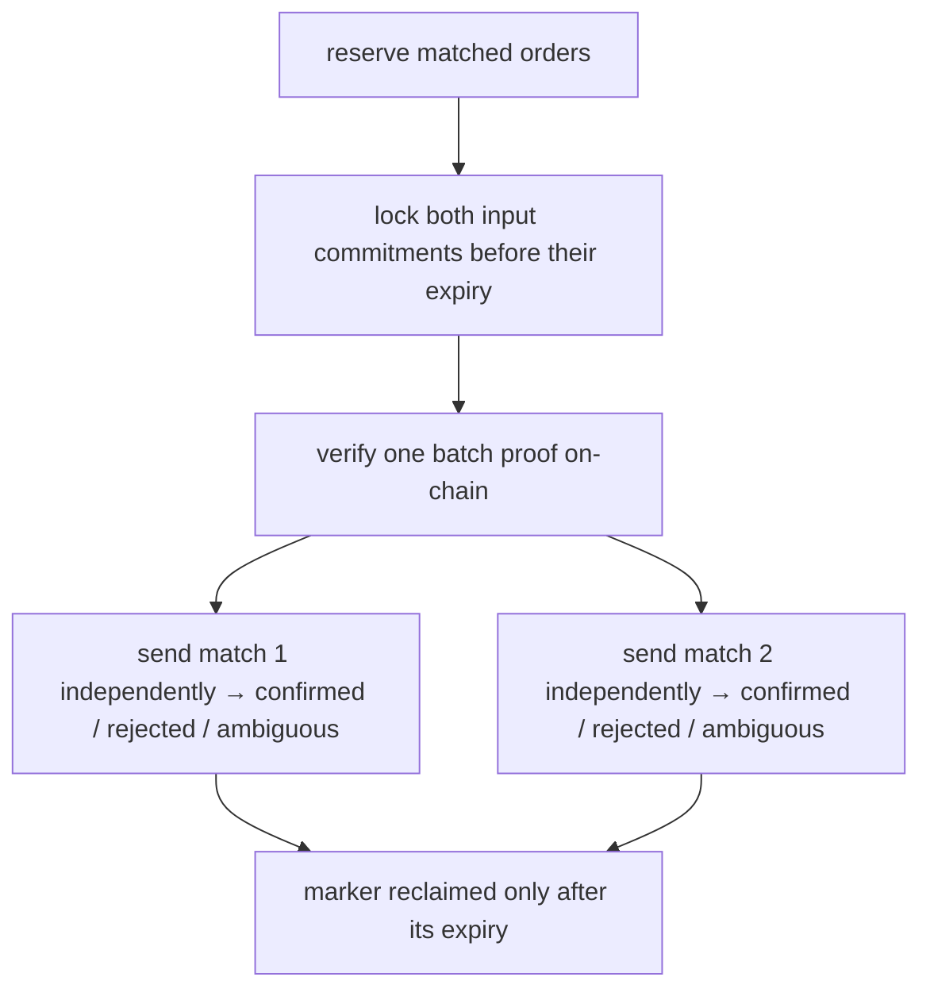

# Settlement

:::info TL;DR
One proof covers up to 16 matches, but each match reaches finality independently.
Inputs are locked, the batch proof is verified on-chain, and each match is sent
as its own atomic settlement. The book changes and fills publish only after a
match confirms. A definitive failure is terminal; an ambiguous result stays
reserved while the engine reconciles it with finalized chain state.
:::

## From private match to public finality

Matching occurs inside the confidential VM. The result settles on Solana, where
the vault verifies the proof and replay guards before appending any output note.
The engine submits the transactions, but it cannot bypass those checks.

A settlement exposes commitments, signatures, and proof data. It does not expose
the order book, traders' limits, or the match's plaintext price and amount.

## The lifecycle

| Stage | User-visible meaning |
|---|---|
| **Reserved** | The matched quantity is unavailable for another match, but the book has not yet committed a fill. |
| **Locked** | On-chain commitment-keyed locks prevent either input from being reused while settlement is in flight. |
| **Proof verified** | One batch proof authorizes its active matches until the batch marker expires. |
| **Per-match settle** | Every match is atomic and independent of the others in the batch. One failure does not hide the results of the rest. |
| **Cleanup** | The shared batch marker is read-only during settlement and can be closed only after expiry. Cleanup is not part of trade finality. |

## Outcomes and order state

Nyx distinguishes uncertainty from failure:

- **Confirmed.** Solana confirmed the settlement. Only now does Nyx decrement
  order quantities and publish the fill and recovery data.
- **Ambiguous.** The RPC result is inconclusive. The orders remain
  `pending_settlement`; the engine reconciles transaction signatures and
  consumed-note accounts, and may safely redrive while the marker is valid.
- **Rejected.** Chain state proves the match cannot settle. Nyx emits
  `settlement_failed` with a reason and lock-expiry slot. It does not silently
  put the old signed order back on the book.

After a definitive failure, wait for the input lock to expire and submit a fresh
signed order. This explicit resubmission prevents a stale order from becoming
live again after the trader believed it had failed.

## What the proof guarantees

For every active match, VALID_MATCH_BATCH binds:

- the configured base and quote mints and price scale;
- positive active amounts and scaled floor pricing with a bounded remainder;
- exact conservation of both assets;
- the on-chain fee rate and protocol fee-note owner;
- user outputs derived from the consumed input inners; and
- fee outputs derived from the consumed commitments.

These constraints stop the matcher from switching assets, inventing value,
changing fees, or redirecting outputs even though amounts remain private.

The proof does **not** re-run the order book. Limit-price compliance, uniform
clearing selection, FIFO, execution attributes, and the oracle circuit-breaker
policy are enforced by the attested matcher. Clients verify that code through
[Privacy & Attestation](./privacy-and-attestation).

## Recovery after confirmation

A confirmed settlement writes encrypted recovery data in the existing fixed-size
envelope. Each side can recover its trade and change amounts with its viewing
key, then deterministically derive the corresponding output openings from the
consumed note. Seed plus finalized chain is the durable recovery source; the
live fills stream is the fast notification path, not the only copy.

See [Settlement Status](../account/settlement-status) for the operator-facing
batch/job response and [Orders Channel](../websocket/orders-channel) for the
trader lifecycle.
