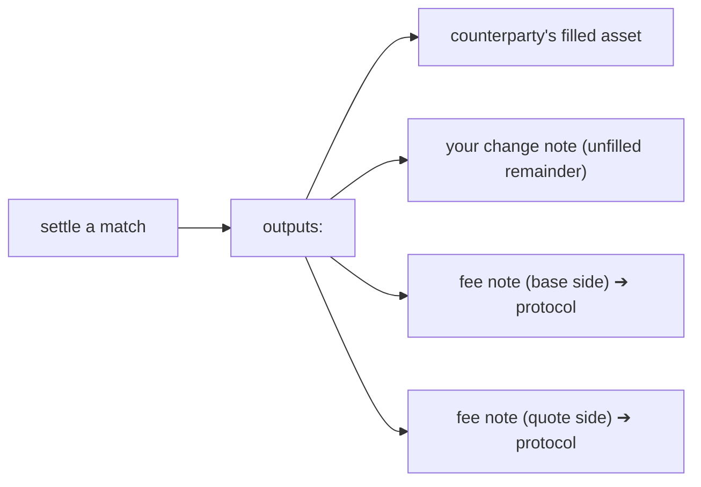

# Fee Structure

:::info TL;DR
Darknyx charges a flat **protocol fee** in basis points (for example, 30 bps). **Both
sides of a trade pay their own fee.** Each order pre-funds its fee as part of its
collateral, and the fee is collected at settlement as a **fee note** minted to the
protocol, so fees, like everything else, settle privately on-chain.
:::

## The fee model

Each side pays in the asset it contributes to the trade. In raw protocol units:

```text
quote_amount = floor(base_amount × clearing_price / price_scale)
buyer fee    = floor(quote_amount × fee_rate_bps / 10_000)  // quote asset
seller fee   = floor(base_amount  × fee_rate_bps / 10_000)  // base asset
```

Two principles define how it is applied:

- **Both legs pay.** The bid and the ask each pay a fee on their own side of the
  trade. There is no maker rebate or taker surcharge, because a batch auction has
  no maker/taker roles (see [Clearing Price](../trading-concepts/clearing-price)).
- **The fee is pre-funded.** An order must lock enough collateral to cover *both*
  its nominal cost *and* its own fee. The required collateral is:

```text
required collateral = nominal cost + fee
```

For a bid, the worst-case nominal quote cost is
`floor(amount × price_limit / price_scale)`; for an ask it is the base `amount`.
The engine derives the applicable floor-rounded fee at intake. If an order's
collateral note does not cover both, the order is rejected rather than allowed
to under-pay.

:::note Collateral must include the fee
Read the finalized market and vault configuration when selecting a collateral
note. The order request carries the note's actual amount; intake recomputes its
commitment and rejects a note that cannot cover the worst-case nominal amount
plus fee. Higher-level wallet software can automate that coin selection, but the
wire-level SDK does not add value to an existing note.
:::

## How fees are collected

Fees are collected **at settlement**, in the same atomic, proven step as the rest
of the trade. When a batch settles, the output notes include the protocol's **fee
notes**, one per asset side, minted alongside the traded asset and any change
note. There is no separate fee transaction and no off-chain fee accounting: the
fee moves as a note, on-chain, under the same zero-knowledge proof that gates the
trade.



Because the fee is charged on the actual cleared amount, an order that locked
fee-inclusive collateral on its worst-case limit and then fills at a better
clearing price gets unused collateral back as part of its change note.

## Worked example

Suppose the fee rate is 30 bps (0.30%) and you place a bid to buy `10` base at a
limit of `150` quote each. Expressed here in human units for readability:

```text
nominal cost   = 10 × 150        = 1500 quote
fee            = 1500 × 30 / 10_000 = 4.5 quote
collateral     = 1500 + 4.5      = 1504.5 quote   ← what your note must cover
```

If the batch clears at `148`, you pay `1480` for the fill, your fee is charged on
the cleared amount, and the difference comes back to you as a change note, all in
one settled, proven step. On-chain arithmetic uses smallest token units and the
configured `price_scale`, with every division rounded down as shown above.

## Why fees settle as notes

Collecting fees as on-chain notes keeps the whole system consistent: there is one
value-movement mechanism (notes, gated by proofs), one place fees are visible (the
public [transparency](../account/transparency) reserves, which account for every
mint including the protocol's), and no privileged off-chain ledger. Fees are as
private and as verifiable as trades.
